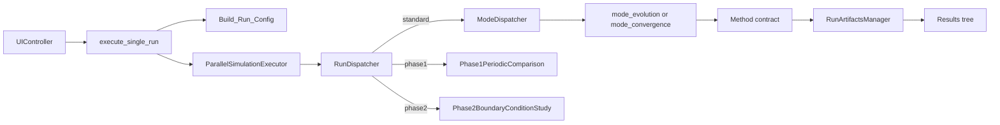
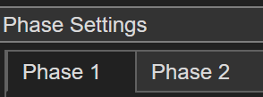
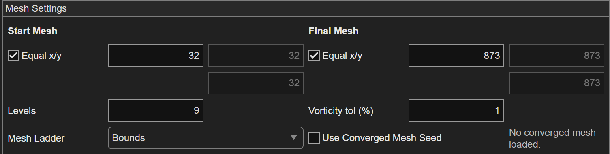
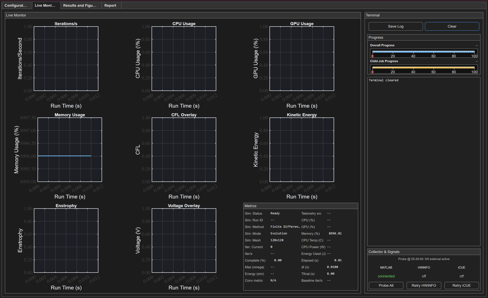
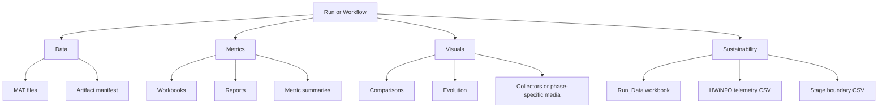

# MECH0020-Numerical-Analysis-of-Tsunami-Vortices-on-Ocean-Surfaces

Numerical framework for studying two-dimensional vortex dynamics, comparison workflows, and phase-structured tsunami-adjacent experiments across multiple method families. The repository is built around a canonical UI-driven runtime, shared dispatch infrastructure, phase workflows, artifact generation, and sustainability telemetry collection.

The current architecture is intentionally split into:

- a canonical user-facing UI path
- compatibility launchers and shims that remain supported
- archived legacy/reference code kept outside the active runtime path

## Table of Contents

- [MECH0020-Numerical-Analysis-of-Tsunami-Vortices-on-Ocean-Surfaces](#mech0020-numerical-analysis-of-tsunami-vortices-on-ocean-surfaces)
  - [Table of Contents](#table-of-contents)
  - [Getting Started](#getting-started)
    - [1. Obtain the repository](#1-obtain-the-repository)
    - [2. Prerequisites](#2-prerequisites)
    - [3. Open MATLAB at the repository root](#3-open-matlab-at-the-repository-root)
    - [4. Launch the framework](#4-launch-the-framework)
  - [Repository Structure](#repository-structure)
    - [Top-level areas](#top-level-areas)
    - [Backend folder guide](#backend-folder-guide)
  - [Key Files of Interest](#key-files-of-interest)
  - [Launching the Framework](#launching-the-framework)
    - [Canonical user-facing launch path](#canonical-user-facing-launch-path)
    - [Compatibility launch path](#compatibility-launch-path)
    - [What each path is for](#what-each-path-is-for)
  - [Canonical Execution Flow](#canonical-execution-flow)
  - [UI Walkthrough](#ui-walkthrough)
    - [Configuration workspace](#configuration-workspace)
    - [Phase workflow settings](#phase-workflow-settings)
    - [Mesh settings](#mesh-settings)
    - [Monitor and terminal workspace](#monitor-and-terminal-workspace)
    - [Results workspace](#results-workspace)
  - [Phase Workflow Explanation](#phase-workflow-explanation)
    - [Standard runs](#standard-runs)
    - [Phase 1](#phase-1)
    - [Phase 2](#phase-2)
  - [Important Feature Areas](#important-feature-areas)
    - [Method selection](#method-selection)
    - [Mode selection](#mode-selection)
    - [Boundary condition selection](#boundary-condition-selection)
    - [Initial condition selection](#initial-condition-selection)
    - [Sustainability and HWiNFO](#sustainability-and-hwinfo)
    - [Convergence and comparison workflows](#convergence-and-comparison-workflows)
    - [Result saving behavior](#result-saving-behavior)
  - [Live Monitor Guide](#live-monitor-guide)
  - [Results and Figures Guide](#results-and-figures-guide)
  - [Saved Results and File Structure](#saved-results-and-file-structure)
    - [Standard run layout](#standard-run-layout)
    - [Phase 1 and Phase 2 workflow layout](#phase-1-and-phase-2-workflow-layout)
    - [Mesh convergence workflow layout](#mesh-convergence-workflow-layout)
    - [Saved file types](#saved-file-types)
    - [Output-routing diagram](#output-routing-diagram)
  - [Example Visuals](#example-visuals)
  - [Current Capabilities](#current-capabilities)
  - [Known Limitations and Caveats](#known-limitations-and-caveats)
  - [Developer Orientation](#developer-orientation)

## Getting Started

### 1. Obtain the repository

Clone the repository locally rather than running it from a network-mounted or deeply nested path. On Windows in particular, cloning close to the drive root is the most reliable setup because the framework produces deep phase/workflow output trees and some MATLAB save paths remain long.

Example:

```powershell
cd C:\
mkdir Git
cd Git
git clone <your-remote-url> MECH0020-Numerical-Analysis-of-Tsunami-Vortices-on-Ocean-Surfaces
```

Recommended working location:

- `C:\Git\MECH0020-Numerical-Analysis-of-Tsunami-Vortices-on-Ocean-Surfaces`
- or another shallow local path with no unusual path-length pressure

### 2. Prerequisites

Assume the following are available:

- MATLAB with App Designer / UI support
- a writable local filesystem for `Results/`
- optional HWiNFO shared-memory availability if live hardware telemetry is required

Optional tooling used by some validation and research helpers:

- Python for helper scripts in `Scripts/Research`
- Quarto if rich report generation is desired

### 3. Open MATLAB at the repository root

```matlab
cd('C:/Git/MECH0020-Numerical-Analysis-of-Tsunami-Vortices-on-Ocean-Surfaces')
```

### 4. Launch the framework

Canonical launch:

```matlab
Tsunami_Vorticity_Emulator('Mode', 'UI')
```

Compatibility launch without the full UI:

```matlab
Tsunami_Vorticity_Emulator('Mode', 'Standard')
```

## Repository Structure

The cleaned repository is easier to read if you think about it in layers: launchers, dispatch infrastructure, modes, method contracts, outputs, and archived material.

```text
Repo Root
|-- Scripts
|   |-- Drivers
|   |-- Infrastructure
|   |   `-- Validation
|   |-- Methods
|   |-- Modes
|   |-- Solvers
|   |-- Sustainability
|   |-- UI
|   |-- Legacy
|   `-- Research
|-- Results
|-- settings
|-- utilities
|-- docs
```

### Top-level areas

- `Scripts/`
  - active backend code, launchers, methods, workflows, UI, and archived legacy code
- `settings/`
  - repo rule settings and execution-policy support files
- `utilities/`
  - shared helpers required by runtime entrypoints
- `docs/`
  - committed onboarding and architecture documentation
- `Results/`
  - canonical runtime outputs for runs and phase workflows
- `Artifacts/`
  - transient tooling/test output area; not a source-of-truth runtime tree

### Backend folder guide

```text
Scripts/
|-- Drivers/         Compatibility launchers and entrypoints
|-- Infrastructure/  Build/config helpers, dispatchers, path setup, validation, utilities
|   `-- Validation/  Readiness smokes, targeted rerun helpers, workbook plotters
|-- Methods/         Active method contracts and archived method-specific legacy code
|-- Modes/           Standard mode implementations and phase workflow owners
|-- Solvers/         Compatibility shims over the active dispatch path
|-- Sustainability/  Collector integration, telemetry export, workbook logic
|-- UI/              Canonical user-facing orchestrator
|-- Legacy/          Archived/reference code excluded from active runtime paths
`-- Research/        Research/report tooling outside the active runtime path
```

## Key Files of Interest

- [`Scripts/UI/UIController.m`](Scripts/UI/UIController.m)
  - canonical user-facing orchestrator
  - owns UI launch, configuration collection, live monitor rendering, and publication back into the results UI
- [`Scripts/Drivers/Tsunami_Vorticity_Emulator.m`](Scripts/Drivers/Tsunami_Vorticity_Emulator.m)
  - compatibility launcher and fallback entrypoint
  - still active, but not the canonical workflow owner
- [`Scripts/Infrastructure/PathSetup.m`](Scripts/Infrastructure/PathSetup.m)
  - path bootstrap gate
  - prunes `Scripts/Legacy` and archive-style trees from the active runtime path
- [`Scripts/Infrastructure/Builds/Build_Run_Config.m`](Scripts/Infrastructure/Builds/Build_Run_Config.m)
  - high-level run contract builder
- [`Scripts/Infrastructure/Dispatchers/RunDispatcher.m`](Scripts/Infrastructure/Dispatchers/RunDispatcher.m)
  - workflow-aware backend dispatcher
- [`Scripts/Infrastructure/Dispatchers/ModeDispatcher.m`](Scripts/Infrastructure/Dispatchers/ModeDispatcher.m)
  - standard mode dispatcher for evolution/convergence/sweep/plotting
- [`Scripts/Infrastructure/Initialisers/create_default_parameters.m`](Scripts/Infrastructure/Initialisers/create_default_parameters.m)
  - single editable source of default numerical/runtime parameters
- [`Scripts/Modes/mode_evolution.m`](Scripts/Modes/mode_evolution.m)
  - single source of truth for standard evolution runs
- [`Scripts/Modes/Phase1PeriodicComparison.m`](Scripts/Modes/Phase1PeriodicComparison.m)
  - Phase 1 workflow owner
- [`Scripts/Modes/Phase2BoundaryConditionStudy.m`](Scripts/Modes/Phase2BoundaryConditionStudy.m)
  - Phase 2 workflow owner
- [`docs/Phase_Workflow_Algorithms.tex`](docs/Phase_Workflow_Algorithms.tex)
  - standalone LaTeX pseudocode for mesh convergence, Phase 1, and Phase 2 with the implemented workflow equations
- [`Scripts/Methods/FiniteDifference/FiniteDifferenceMethod.m`](Scripts/Methods/FiniteDifference/FiniteDifferenceMethod.m)
  - active finite-difference runtime contract
- [`Scripts/Solvers/run_simulation_with_method.m`](Scripts/Solvers/run_simulation_with_method.m)
  - compatibility shim over the active dispatcher path
- [`Scripts/Sustainability/ExternalCollectorDispatcher.m`](Scripts/Sustainability/ExternalCollectorDispatcher.m)
  - collector export, telemetry packaging, workbook generation
- [`Scripts/Infrastructure/Utilities/RunArtifactsManager.m`](Scripts/Infrastructure/Utilities/RunArtifactsManager.m)
  - canonical run-artifact finalization layer

## Launching the Framework

### Canonical user-facing launch path

The main intended path is the UI:

```matlab
Tsunami_Vorticity_Emulator('Mode', 'UI')
```

From there, configuration is collected in the UI and the backend executes through the shared dispatcher/executor stack.

### Compatibility launch path

The compatibility launcher remains useful for:

- standard non-UI launches
- manual fallback use
- older scripts that still enter through the launcher

It is deliberately not the owner of phase-workflow orchestration.

### What each path is for

- `UIController`
  - authoritative user-facing runtime path
  - full workflow dispatch, live monitoring, result registration
- `Tsunami_Vorticity_Emulator`
  - compatibility startup surface
  - standard/manual fallback entry
- `run_simulation_with_method`
  - compatibility shim for older scripts/tests that expect a direct method runner

## Canonical Execution Flow



## UI Walkthrough

### Configuration workspace

The configuration tab is the main setup surface for method selection, mode selection, initial conditions, run policy, and phase-specific controls.

Typical use in this area:

- pick method and run mode
- choose boundary and initial conditions
- configure phase-specific study settings
- decide save/monitor/report policies before launch

### Phase workflow settings

Phase workflow controls for Phase 1 and Phase 2 sit directly inside the configuration workspace. The workflow tab strip for those study owners is shown here.



At a glance this area is used to:

- switch between Phase 1 and Phase 2 study setup
- confirm which workflow settings surface is active
- access the Phase 1 and Phase 2 study configuration areas before dispatch

### Mesh settings

Mesh-convergence controls are grouped inside the configuration workspace so the start mesh, final mesh, ladder spacing, and tolerance policy can be reviewed before launch.



This section is where you typically:

- set the start and final mesh levels
- choose the ladder policy and number of levels
- keep x/y coupling locked when square meshes are intended
- review convergence tolerance before the workflow queue is built

### Monitor and terminal workspace

The monitoring tab shows progress, terminal output, and collector state while the backend runs.



What to expect here:

- queue/child progress for workflow runs
- terminal-style textual updates
- collector source and runtime status summaries
- live monitor plots when full monitor mode is enabled

### Results workspace

After completion, the results tabs are the review surface for:

- standard run outputs
- workflow summaries
- phase-specific comparison figures
- saved artifact registration and navigation

## Phase Workflow Explanation

### Standard runs

Standard runs go through `ModeDispatcher` and then into a single mode implementation such as `mode_evolution` or `mode_convergence`.

### Phase 1

Phase 1 is a periodic FD-vs-Spectral workflow that combines:

- convergence jobs
- post-convergence evolution jobs
- comparison metrics
- saved plots and workbooks

It is owned by `Phase1PeriodicComparison.m`, not by the compatibility launcher.

### Phase 2

Phase 2 is a boundary-condition study workflow. The current active implementation is FD-focused and runs the calibrated elliptic Gaussian and Taylor-Green cases across the configured boundary-condition matrix while owning its own queue, manifest, workbook, and combined-media outputs.

## Important Feature Areas

### Method selection

Active method families currently exposed in the backend include:

- finite difference
- spectral
- finite volume
- shallow water

Not every method is enabled for every mode. The dispatcher path is the authority on current compatibility.

### Mode selection

Important standard modes include:

- `Evolution`
- `Convergence`
- `ParameterSweep`
- `Plotting`

Workflow phases are not ordinary modes; they are routed by `RunDispatcher`.

### Boundary condition selection

Boundary-condition meaning is normalized through `BCDispatcher`, not duplicated independently per method entrypoint.

### Initial condition selection

Initial-condition generation is normalized through `ICDispatcher`, with method-aware configuration shaping handled before the method contract executes.

### Sustainability and HWiNFO

The repository supports collector-backed sustainability output, including HWiNFO integration, CSV packaging, telemetry segmentation, and workbook export when the active settings enable those paths.

### Convergence and comparison workflows

The repository includes:

- standard convergence mode
- Phase 1 periodic comparison workflow
- Phase 2 boundary-condition workflow
- workflow-specific comparison figures and metrics
- saved workbook/report contracts

### Result saving behavior

New writes use the compact layout rooted in `Results/` and split standard runs from phase workflows using shallow run roots and per-run `Data`, `Metrics`, and `Visuals` folders. Mesh convergence additionally publishes its telemetry workbook and collector CSVs into a dedicated `Sustainability/` folder.

## Live Monitor Guide

The live monitor is meant to answer three questions:

1. What is running now?
2. How far through the queue or child job are we?
3. What collector/runtime sources are live?

Interpret the monitor as follows:

- queue progress
  - overall workflow progression through phase child jobs
- child progress
  - active child run or convergence level progression
- terminal pane
  - concise execution narrative and warnings
- collector area
  - source status for telemetry/collector integrations

The old figure-based live monitor helpers are archived under `Scripts/Legacy/Monitoring/` and are not the active path.

## Results and Figures Guide

The results surface and saved outputs are aligned:

- comparison plots written to `Visuals/Comparisons/` appear in workflow result views
- evolution snapshots and animations live under the per-run visual tree
- workbooks and reports live under `Metrics/`
- MAT/manifest data live under `Data/`
- mesh-convergence telemetry workbooks and collector CSVs live under `Sustainability/` when that workflow is used

For phase workflows, the UI results tabs summarize the child runs and combined workflow products rather than exposing each backend file individually.

## Saved Results and File Structure

### Standard run layout

```text
Results/
  <Method>/
    <StorageId>/
      Run_Settings.txt
      Data/
      Metrics/
      Visuals/
```

### Phase 1 and Phase 2 workflow layout

```text
Results/
  Phases/
    <PhaseName>/
      <StorageId>/
        Run_Settings.txt
        Data/
        Metrics/
        Visuals/
```

### Mesh convergence workflow layout

```text
Results/
  Phases/
    MeshConvergence/
      <StorageId>/
        Run_Settings.txt
        Data/
        Metrics/
        Sustainability/
        Visuals/
```

### Saved file types

- `Run_Settings.txt`
  - compact textual record of configuration and key settings
- `Data/*.mat` and `artifact_manifest.json`
  - saved result payloads and manifests
- `Metrics/*.xlsx`, `*.md`, `*.json`, `*.csv`
  - workbooks, reports, telemetry exports, summaries
- `Sustainability/*.xlsx`, `*.csv`
  - mesh-convergence sustainability workbook, HWiNFO telemetry, and stage-boundary exports where enabled
- `Visuals/*.png`, `*.gif`, `*.fig`
  - figures and animations where enabled by policy

### Output-routing diagram



## Example Visuals


## Current Capabilities

The framework currently supports:

- canonical UI-driven execution
- compatibility launchers for standard/manual flows
- method-aware mode dispatch for multiple solver families
- Phase 1 and Phase 2 workflows routed through `RunDispatcher`
- compact per-run artifact layout
- sustainability collector integration and workbook generation
- comparison/convergence workflows with saved figures and reports
- archived legacy/reference code that is explicitly kept off the active runtime path

## Known Limitations and Caveats

- `Scripts/UI/UIController.m` is intentionally large and remains the main user-facing orchestrator.
- Compatibility shims still exist and should not be treated as dead code.
- Not every method is available for every mode; dispatcher gating is the source of truth.
- Local MATLAB path pollution can create noisy warnings if stale paths outside this repo remain configured.
- GPU use depends on the planner/runtime contract and host availability; unsupported requests are expected to fall back safely.
- `Results/` and most of `Artifacts/` are ignored output areas, so committed documentation must use `docs/assets/` rather than live run paths.
- Mesh Convergence can take roughly 4 hours
- Phase 1 can take up to 6 hours roughly
- Phase 2 can take upto 8 hours roughly
- Each run of these phases will require at least 10GBs of storage to store the simulation data
